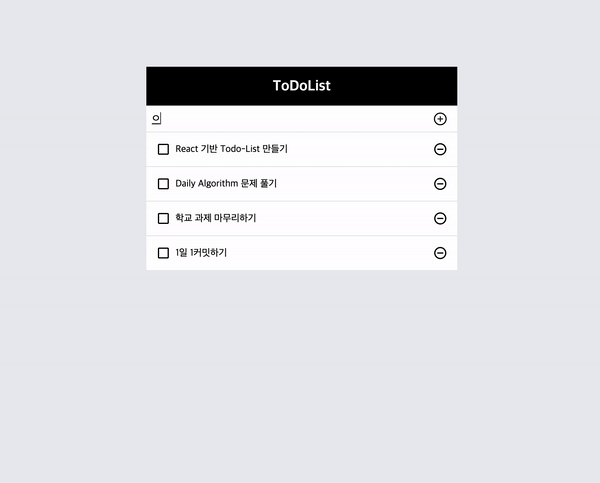
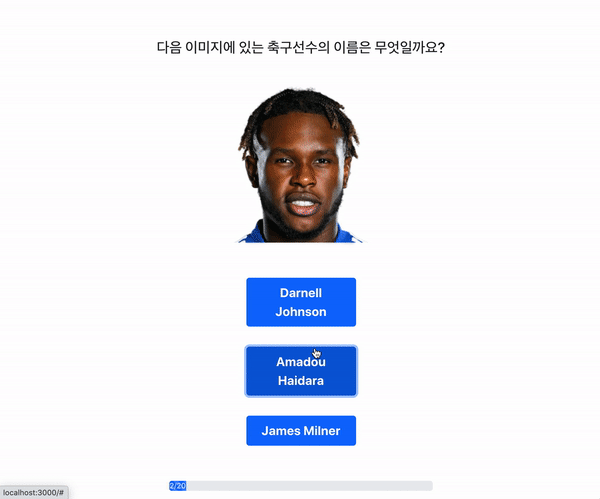
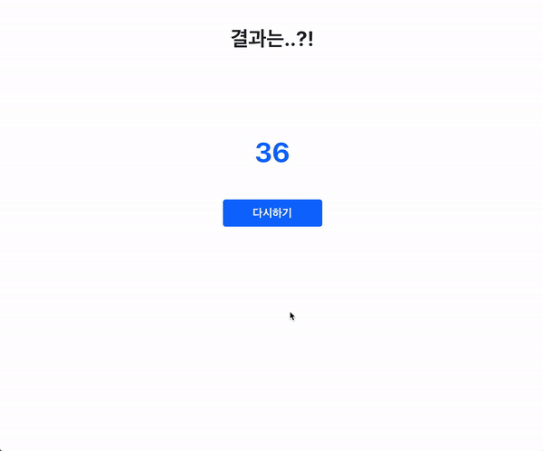
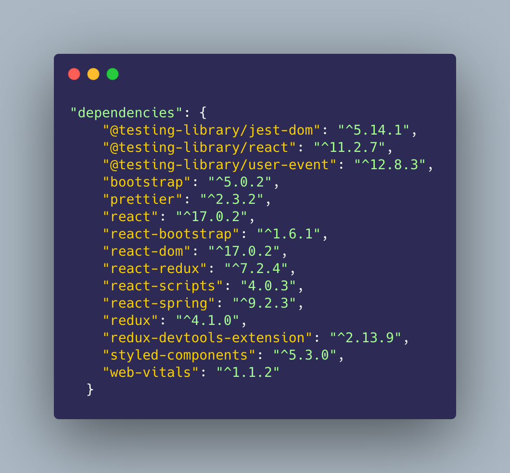

# js_small_project

toDoList, search 등 - VanilaJs, React

## Vanila

> ToDoList

> Search

## React

> ToDoList

</img>

등록, 삭제, 완료 토글 버튼을 React hook을 사용해 구현

> News Page

</img>

axios를 사용하여 News API를 받아와 카테고리 별로 보여주었다

React-Router를 사용하여 수정할 예정

> Soccer Player Quize Site

사진에 보이는 축구 선수의 이름을 맞춰서 얻은 Score를 확인해보자!

</img>

</img>

사용한 패키지

</img>
